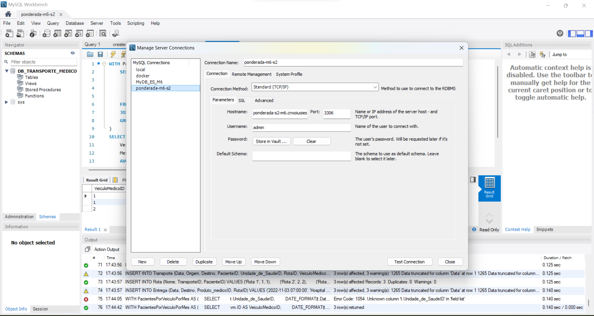
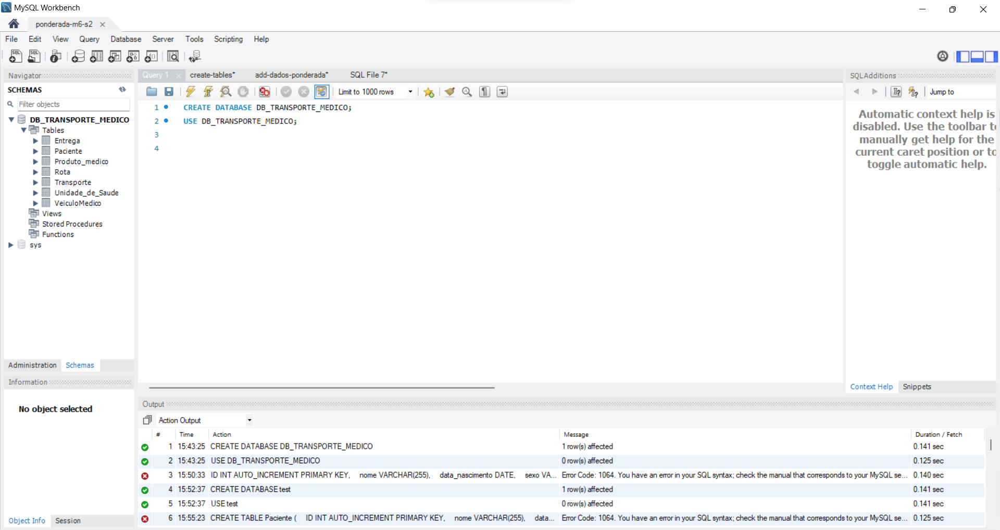
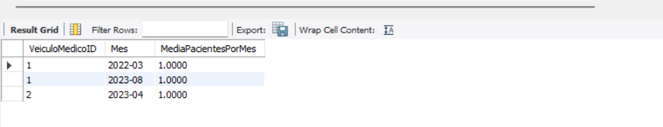

# PONDERADA-S2-M6

## Modelo Lógico
O modelo lógico do banco de dados está representando a estrutura e a organização dos dados de uma maneira independente. 


Crie um diagrama do modelo lógico.
## Banco de Dados na AWS:

Aqui temos a conexão com o Banco do RDS através do endpoint e autenticação.



Criação e uso do Database que comporta as tabelas.


## Modelo Físico:

Queries SQL utilizadas para criar as tabelas:

``` 
    CREATE TABLE Paciente (
    ID INT AUTO_INCREMENT PRIMARY KEY,
    Nome VARCHAR(255),
    DataNascimento DATE,
    contato VARCHAR(20),
    Sexo VARCHAR(10),
    Unidade_de_SaudeID INT,
    RotaID INT
);

CREATE TABLE Unidade_de_Saude (
    ID INT AUTO_INCREMENT PRIMARY KEY,
    Nome VARCHAR(255),
    Endereco VARCHAR(255),
    Contato VARCHAR(20),
    Produto_medicoID INT
);

CREATE TABLE Produto_medico (
    ID INT AUTO_INCREMENT PRIMARY KEY,
    Nome VARCHAR(255),
    Descricao VARCHAR(50),
    Estoque INT
);

CREATE TABLE VeiculoMedico (
    ID INT AUTO_INCREMENT PRIMARY KEY,
    Placa VARCHAR(10), 
    Tipo VARCHAR(50),  
    Capacidade INT      
);

CREATE TABLE Transporte (
    ID INT AUTO_INCREMENT PRIMARY KEY,
    Data DATE,
    Origem VARCHAR(100),
    Destino VARCHAR(100),
    PacienteID INT,
    Unidade_de_SaudeID INT,
    RotaID INT,
    VeiculoMedicoID INT 
);

CREATE TABLE Rota (
    ID INT AUTO_INCREMENT PRIMARY KEY,
    Nome VARCHAR(255),
    TransporteID INT,
    PacienteID INT
);

CREATE TABLE Entrega (
    ID INT AUTO_INCREMENT PRIMARY KEY,
    Data DATE,
    Destino VARCHAR(20),
    Produto_medicoID INT,  
    RotaID INT
);
```
## Inserção de Dados de Teste:  

Aqui vamos inserir dados fictícios nas tabelas

```
INSERT INTO Unidade_de_Saude (Nome, Endereco, Contato, Produto_medicoID)
VALUES ('Hospital A', 'Rua Hospital A', '123-456-7890', 1),
       ('Clínica B', 'Avenida Clínica B', '987-654-3210', 2),
       ('Posto de Saúde C', 'Praça Saúde C', '555-123-4567', 3);

INSERT INTO Produto_medico (Nome, Descricao, Estoque)
VALUES ('Medicamento X', 'Descrição do Medicamento X', 100),
       ('Equipamento Y', 'Descrição do Equipamento Y', 50),
       ('Medicamento Z', 'Descrição do Medicamento Z', 200);

INSERT INTO VeiculoMedico (Placa, Tipo, Capacidade)
VALUES ('ABC123', 'Ambulância', 4),
       ('XYZ789', 'Van Médica', 8),
       ('MNO456', 'Carro de Apoio', 6);

INSERT INTO Paciente (Nome, DataNascimento, contato, Sexo, Unidade_de_SaudeID, RotaID)
VALUES ('João', '1990-05-15', '111-222-3333', 'Masculino', 1, 1),
       ('Maria', '1985-11-20', '444-555-6666', 'Feminino', 2, 2),
       ('Pedro', '2000-03-10', '777-888-9999', 'Masculino', 3, 3);

INSERT INTO Transporte (Data, Origem, Destino, PacienteID, Unidade_de_SaudeID, RotaID, VeiculoMedicoID)
VALUES ('2023-08-23 08:00:00', 'Hospital A', 'Casa do Paciente 1', 1, 1, 1, 1),
       ('2023-04-05 08:00:00', 'Clínica B', 'Hospital A', 2, 2, 2, 2),
       ('2022-03-21 08:00:00', 'Posto de Saúde C', 'Hospital A', 3, 3, 3, 1);

INSERT INTO Rota (Nome, TransporteID, PacienteID)
VALUES ('Rota 1', 1, 1),
       ('Rota 2', 2, 2),
       ('Rota 3', 3, 3);

INSERT INTO Entrega (Data, Destino, Produto_medicoID, RotaID)
VALUES ('2022-11-03 07:00:00', 'Hospital A', 1, 1),
       ('2022-12-04 05:30:00', 'Hospital A', 2, 2),
       ('2023-09-03 11:15:00', 'Hospital A', 3, 3);

```
## Consulta SQL:
Aqui faremos a consulta SQL para descobrir o número médio de pacientes transportados por veículo por mês:
``` 
WITH PacientesPorVeiculoPorMes AS (
    SELECT
        vm.ID AS VeiculoMedicoID,
        DATE_FORMAT(t.Data, '%Y-%m') AS Mes,
        COUNT(DISTINCT t.PacienteID) AS NumeroDePacientes
    FROM Transporte t
    JOIN VeiculoMedico vm ON t.VeiculoMedicoID = vm.ID
    GROUP BY VeiculoMedicoID, Mes
)
SELECT
    VeiculoMedicoID,
    Mes,
    AVG(NumeroDePacientes) AS MediaPacientesPorMes
FROM PacientesPorVeiculoPorMes
GROUP BY VeiculoMedicoID, Mes
ORDER BY VeiculoMedicoID, Mes;
```
## Resultado da Consulta:



## Links 

Endpoint da RDS: ponderada-s2-m6.cnxoiuoiesei.us-east-1.rds.amazonaws.com

